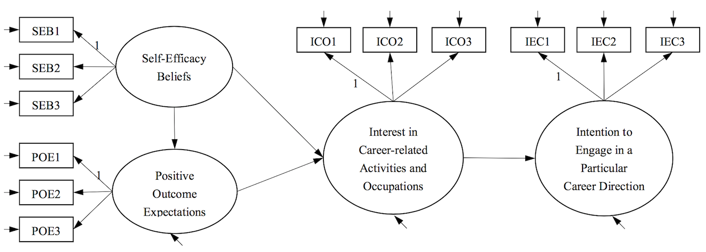

# Use the covariance matrix in Weston & Gore (2006)

In the present model, self-efficacy beliefs ($SEB$), positive outcome expectations ($POE$), interests in career-related activities and occupations ($ICO$), and intention to engage in a particular career direction ($IEC$) are four latent variables and are shown by the circles. Observed variables were represented by rectangles. All latent variables are reflected by their own observed variables. Direct effects are also specified in this model. All latent variables are scaled by fixing a loading from the latent variable to an observed variable (e.g., $SEB$ to $SEB_{1}$). The specified model is shown in Figure 1.

We have analyzed the data by using the `lavaan` package in `R`. The `lavaan` package is a free open source package that provide `R` users a good platform to perform latent variable related analysis, such as structural equation modeling (SEM). In the present work, we have analyzed the data in Weston & Gore (2006) and replicate the results in the paper.

The specified model is an over-identified model. There are 28 parameters to be estimated and a total number of 50 degree of freedom. The sample size is 403. The maximum likelihood estimator, which assumes multivariate normality is used in the present work. The optimization procedure used here is the PORT routines in the `nlminb` package. To be more specific, Broyden–Fletcher–Goldfarb–Shanno (BFGS) algorithm is adopted. It belongs to quasi-Newton methods with Hessian approximation ([for details](https://en.wikipedia.org/wiki/Broyden%E2%80%93Fletcher%E2%80%93Goldfarb%E2%80%93Shanno_algorithm)). 

Figure 2 shows the standardized results for the specified model. Results and fit indexes are shown as follow. Fit of the model: ${\chi}^2(50, N = 403)$ = $417.096$, $p < .05$; comparative fit index (CFI) = .913; root mean square error of approximation (RMSEA, 90% confidence interval) = .135 (.123 – .147); standardized root mean square residual (SRMR) = .052. Although no other model are presented here to perform the comparison, akaike information criterion (AIC), bayesian information criterion (BIC), and sample-size adjusted BIC (SABIC) are listed. AIC: 12614.681; BIC: 12726.651; SABIC: 12637.804. In addition to the standardized results in Figure 2, all estimates are shown in Table 1. Note that the results is really similar to the Figure 4 in Weston & Gore (2006). The only difference is that they show the disturbances but the present work shows the variance of the disturbances (e.g., disturbance of $POE$: $.788^2 = .621$). 

We conclude that the results of `lavaan` and `EQS` are roughly the same. It is reasonable since the estimators used are the same (i.e., ML). Also, it somehow echoes the stability of the model and the sample data.

